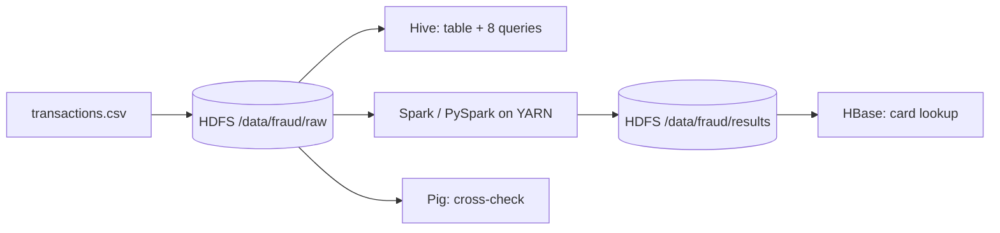

# Credit Card Fraud Detection: Big Data Analytics Capstone

HCL GUVI × Jain University · Big Data Analytics Capstone · Group 2

An end-to-end Big Data pipeline over **1,000,000 card transactions**: data in **HDFS**, SQL analysis in **Hive**, distributed analytics and fraud-risk models in **Spark / PySpark** on **YARN**, with **HBase** and **Pig** as supporting tools. Everything runs as containers in the course Docker Compose environment.

> **Synthetic data.** The dataset is generated by `data/generate_dataset.py` (seed 42) with fraud patterns built in. Findings show the pipeline working and are not claims about real-world fraud.
> **What was executed.** The Spark pipeline and the 8 SQL queries were run on all 1M rows in Spark local mode. The HDFS, Hive, YARN, HBase and Pig steps are provided as scripts and must be run in your Docker environment; add your screenshots to `screenshots/`.

## Architecture



More detail: [docs/ARCHITECTURE.md](docs/ARCHITECTURE.md). Docker steps: [docs/DOCKER_GUIDE.md](docs/DOCKER_GUIDE.md).

## Key results (1M transactions, 0.529% fraud)

| Finding | Value |
|---|---|
| Riskiest category | Gift Cards 2.03% (3.8x overall); Jewelry 1.87%; Electronics 1.38% |
| Riskiest channel | Online, card not present: 1.22% (68.8% of all fraud) |
| Riskiest hours | 23:00 to 04:59: 1.16% vs 0.49% rest of day |
| International + 5 or more txns in 24 h | 7.41% (about 14x overall) |
| Best model | Logistic Regression, AUC-ROC 0.861 |
| Review top 1% of transactions | Catches 23.6% of fraud (22.8x lift); about 88% of the queue is still genuine |

Models were trained on Jan to Sep and tested on Oct to Dec, with class weights for the 0.5% fraud rate. See the report for full tables and charts.

## Repository layout

```
data/        generate_dataset.py, sample/, README.md (data dictionary)
hdfs/        hdfs_commands.txt
hive/        01_create_database.sql, 02_create_tables.sql, 03_analysis_queries.sql
spark/       hdfs_connect.py, fraud_analysis.py, run_sql_queries.py, make_charts.py
hbase/       hbase_commands.txt
pig/         fraud_analysis.pig
results/     Hive query outputs, Spark summaries, pipeline_metrics.json
screenshots/ evidence checklist + generated figures
docs/        report (docx), architecture, Docker guide, contributions, project page
```

## Quick start

**Local check (no Docker):**

    pip install -r requirements.txt
    python data/generate_dataset.py --rows 1000000 --out data/transactions.csv
    python spark/run_sql_queries.py data/transactions.csv results/hive
    python spark/fraud_analysis.py data/transactions.csv results/spark_out    # about 4 min on 2 cores

Java 17 or newer is needed for PySpark.

**Course Docker environment (HDFS, Hive, YARN, Spark):** follow [docs/DOCKER_GUIDE.md](docs/DOCKER_GUIDE.md). The quickest route is `spark/hdfs_connect.py`, which uploads the CSV to HDFS and runs the analysis there.

## Documentation

| Document | Purpose |
|---|---|
| [docs/Credit_Card_Fraud_Detection_Big_Data_Project.docx](docs/Credit_Card_Fraud_Detection_Big_Data_Project.docx) | Full project report in the capstone template |
| [data/README.md](data/README.md) | Dataset and data dictionary |
| [docs/ARCHITECTURE.md](docs/ARCHITECTURE.md) | Components and data flow |
| [docs/DOCKER_GUIDE.md](docs/DOCKER_GUIDE.md) | Run, verify and troubleshoot in Docker |
| [results/README.md](results/README.md) | What each result file is |
| [docs/TEAM_CONTRIBUTIONS.md](docs/TEAM_CONTRIBUTIONS.md) | Who owns what |
| docs/project_page.html | Self-contained visual summary (open in a browser) |

## Limitations

- Synthetic data; patterns were designed in, so SQL findings are expected rather than discovered.
- AUC-PR is modest (0.078) because labels contain random noise.
- Spark ran in local mode; no cluster speed-up was measured.
- The top-merchant query (Q8) shows small-sample variation, not risky merchants.
- Batch pipeline only; real-time scoring would need a streaming layer.
