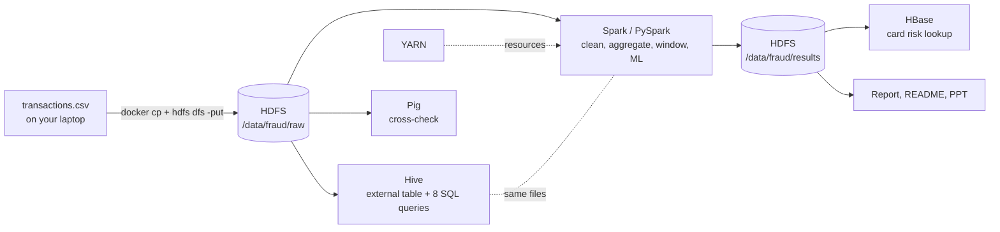

# Architecture

## HDFS layout

    /data/fraud/
      raw/transactions.csv
      processed/            (partitioned Parquet from Spark)
      results/              (11 summary tables, one folder each)

## Roles

| Component | Role |
|---|---|
| HDFS NameNode / DataNode | File metadata and block storage |
| YARN | Allocates containers to Spark executors |
| Hive | SQL table layer (external table, so dropping it keeps the file) |
| Spark / PySpark | Distributed cleaning, features, aggregations, window functions, MLlib models |
| HBase | Millisecond lookup of one card's risk profile (row key = card_id) |
| Pig | Independent cross-check of channel fraud counts |

## Hive vs Spark

Hive gives analysts a SQL layer over the files. Spark does the work SQL handles badly: derived features, window analytics, joins with other data and machine learning, in one workflow.

## Validation

Hive Q1 to Q8, Spark summaries and Pig must agree. The build script `docs/build_report.py` asserts eight cross-checks (record counts, category and channel totals, month totals, train+test = total).
